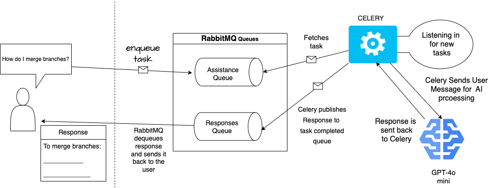

# Customer Support AI based Chat for Git

> _This repository contains frontend and backend implementation of customer support chat where the user inquires about an issue with Git and an OpenAI model provides a solution._
---
### Tech Stack

* React: frontend with [Ant-design](https://github.com/ant-design/ant-design) for ready-built components
* Flask: Backend
* Flask SQLAlchemy: Database integrated into flask that sotres message exchanges between the user and AI model and related request errors/status
* OpenAI: GPT-4o mini model, instructed to take in user input and reply only within Git context
* RabbitMQ: Message broker that sorts recieved/sent messages(tasks) into respective queues
* Pika: Our bridge to RabbitMQ, through it we declare queues, publish and consume messages.
* Celery**: Monitors RabbitMQ's queue for new messages(tasks) to consume and sends it to OpenAI

---
## Execution Diagram

---
### Running 
After cloning the project run the following:

Install requirements:\
`pip install -r requirements.txt`

A docker instance of RabbitMQ on port 5672, headover to localhost:15672 to monitor tasks being published and consumed in RabbitMQ's queues:\
`docker run -it --rm --name rabbitmq -p 5672:5672 -p 15672:15672 rabbitmq:4.0-management`

Celery:\
`celery -A app.src.messages.celery_app worker --loglevel=info`

consumer.py that listens in on _Assistance Queue_ on behalf of celery:\
`python3 -m app.src.consumer`

Flask:\
`flask --app app.src.run --debug run`

React('npm install -g create-react-app' if you do not have React):\
`npm start`

##### ** _The use of Celery in (supposedly) a real-time chat system is not the perfect choice as Celery is better tailored for backgroud tasks that do not require instantaneous response. Celery was only used for conceptual learning. Instead, Websockets (ex: Flask-SocketIO) should be used._

